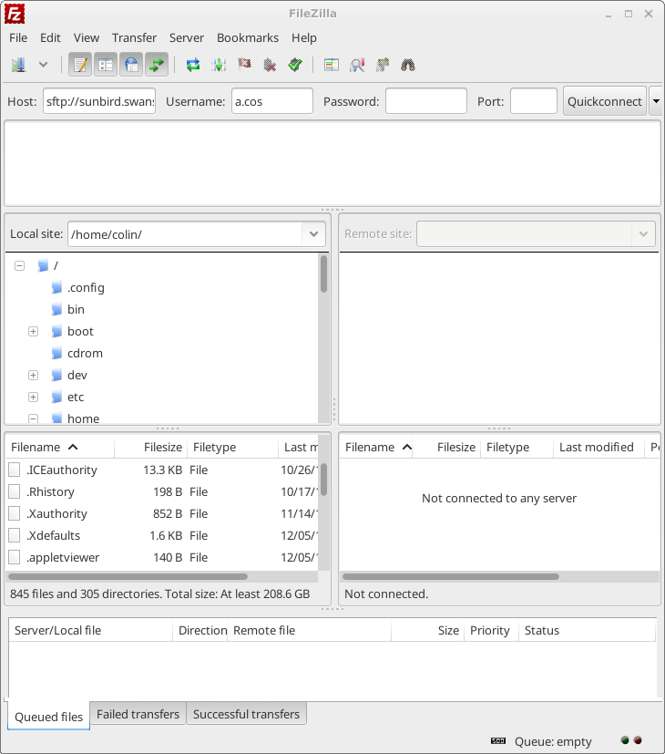
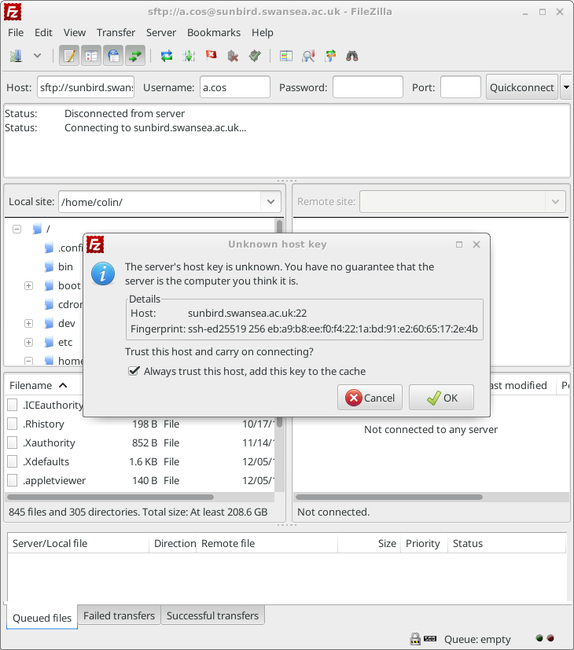
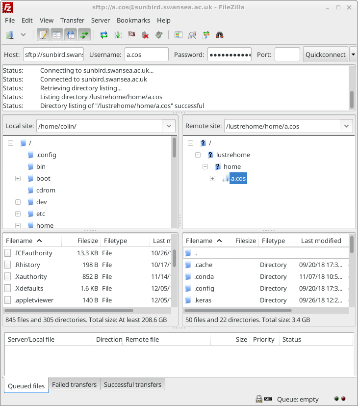
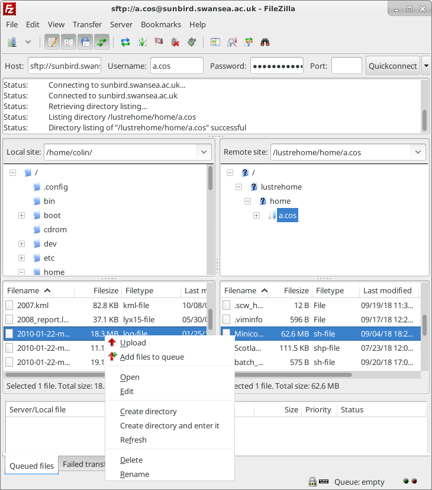
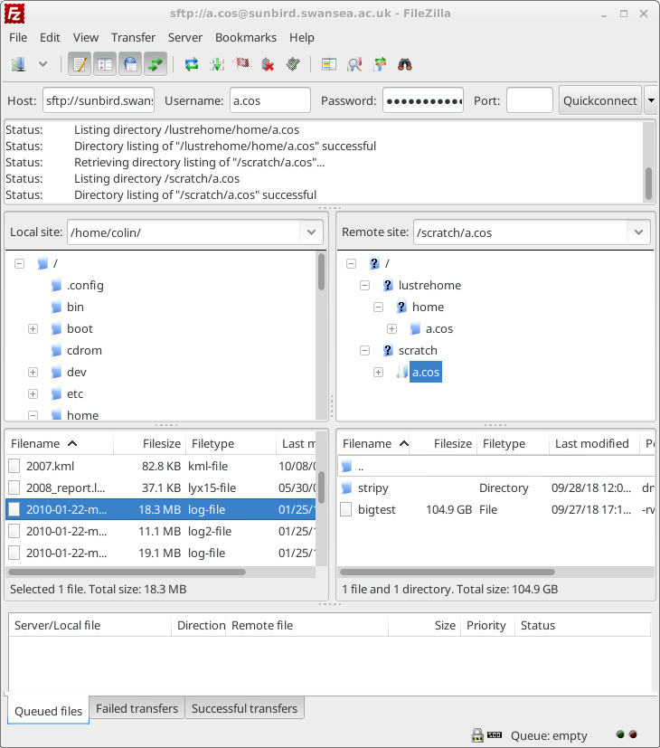

# Filesystems and Storage

## What is a filesystem?
Storage on most compute systems is not what and where you think they are! Physical disks are bundled together into a virtual volume; this virtual volume may represent one filesystem, or may be divided up, or partitioned, into multiple filesystems. And your directories then reside within one of these fileystems. Filesystems are accessed over the network through mount points.

There are multiple storage/filesystems options available for you to do your work. The most common are:
* home: where you land when you first login. 50 GB per user. Slower access, backed up (Cardiff only). Used to store your work long term. 
* project: shared between all users of a project. Same filesystem as home. 
* scratch: temporary working space. Faster access, not backed up. No quota, but old files might get deleted. DON'T STORE RESULTS HERE!

Here's a synopsis of filesystems on Hawk in Cardiff:

|Name|Path|Default Quota|Disk Size|Backed Up|
|------|---|----|-----|---|-----|
|Home|/home/user.name|50GB|420TB|Only in Cardiff|
|Group|/home/scwXXXX|Negotiable|420TB (same disk as home)|Only in Cardiff|
|Scratch|/scratch/user.name|N/A|692TB|No|

and on Sunbird in Swansea:

|Name|Path|Default Quota|Disk Size|Backed Up|
|------|---|----|-----|---|-----|
|Home|/home/user.name|100GB|231TB|No|
|Group|/home/scwXXXX|Negotiable|231TB (same disk as home)|No|
|Scratch|/scratch/user.name|N/A|808TB|No|


**Important!! Ensure that you don't store anything longer than necessary on scratch, this can negatively affect other people’s jobs on the system.**


# Accessing your filestore

## How much quota do I have left on my home directory?

Login to a head node (e.g. sunbird.swansea.ac.uk or hawklogin.cf.ac.uk) and run the ```myquota``` command. This will tell you how much space is left in your home directory. 

~~~
$ myquota
~~~
{: .bash}

~~~
Disk quotas for grp a.cos (gid 5000124):
     Filesystem    used   quota   limit   grace   files   quota   limit   grace
          /home  19.09G    100G    105G       -   36866  100000  105000       -
~~~
{: .output}

## Group Filestore
    

## How much scratch have I used?

The ```df``` command tells you how much disk space is left. The ```-h``` argument makes the output easier to read, it gives human readable units like M, G and T for Megabyte, Gigabyte and Terrabyte instead of just giving output in bytes. By default df will give us the free space on all the drives on a system, but we can just ask for the scratch drive by adding ```/scratch``` as an argument after the ```-h```. 

~~~
$ df -h /scratch
~~~
{: .bash}

~~~
Filesystem                                Size  Used Avail Use% Mounted on
172.2.1.51@o2ib:172.2.1.52@o2ib:/scratch  692T   57T  635T   9% /scratch
~~~
{: .output}

## Copying data from your PC to SCW

You can copy files to/from your SCW home and scratch drives using the secure copy protocol (SCP) or secure file transfer protocol (SFTP) and connecting to Sunbird or Hawk. 

### Copying data using SFTP

Use the ```sftp``` command and connect to the system. This takes the argument of the username followed by an @ symbol and then the hostname. Optionally you can specify what directory to start in by putting a ```:``` symbol after this and adding the directory name. The command below will start in ```/home/s.jane.doe/data```, if no directory is specified then sftp defaults to your home directory. 

~~~
sftp s.jane.doe@sunbird.swansea.ac.uk:/home/s.jane.doe/data
~~~
{: .bash}


~~~
s.jane.doe@sunbird.swansea.ac.uk's password: 
Connected to sunbird.swansea.ac.uk.
Changing to: /home/s.jane.doe/data
sftp> ls
~~~
{: .output}


The ```sftp``` and ```scp``` commands should be available on all Linux and Mac systems. Windows 10 systems with the April 2018 update (Spring 2018 Creators Edition) should also include it. For older versions On Windows systems they can be made available if you install the Linux Subsystem for Windows (Windows 10 only) or through [Git for Windows](https://gitforwindows.org).
Aberystwyth University Windows desktops already have these commands installed. 

#### SFTP commands
SFTP uses many of the same commands as the Unix command line and the older FTP system which it has replaced. Most commnads by default run on the remote system, putting an `!` in front of the command runs it on the local system. Some common commands are shown below.
~~~
ls - lists files on the remote system
!ls - lists files on the local system
pwd - reports the current directory on the local system
!pwd - reports the current directory on the remote system
get - gets a file from the remote system
put - sends a file to the remote system
rm - delete a file on the remote system
cd - change directory on the remote system
lcd - change directory on the local system
~~~
{:. callout}


### Copying data using Filezilla

Filezilla is a graphical SCP/SFTP client available for Windows, Mac and Linux. You can download it from [Filezilla download](https://filezilla-project.org/download.php?type=client)

Open filezilla and type ```sftp://sunbird.swansea.ac.uk``` or ```sftp://hawklogin.cf.ac.uk``` into the host box. Enter your username and password in the username/password boxes.



Click Quickconnect and a connection will be started. The first time you connect you will be asked to verify the host key, tick the "Always trust this host, add key to the cache" box to stop this message appearing again in future.



You should now have some files in the right hand side of the window. These are on the remote system, the list on the left hand side is your local system.



Files can be transferred either by dragging and dropping them from one side to the other. Or you can right click on a remote file and choose "Download" or a local file and choose "Upload". 




You can change directory on the remote host by typing a path into the "Remote site:" box. For example type in ```/scratch/user.name``` (where user.name is your username) to access your scratch directory. 




# Exercises

> ## Using the `df` command. 
> 1. Login to a head node
> 2. Run the command `df -h`.
> 3. How much space does /scratch have left? 
> 4. If you had to run a large job requiring 10TB of scratch space, would there be enough space for it?
{: .challenge}

> ## Using the `myquota` command.
> 1. Login to a head node.
> 2. Run the `myquota` command. 
> 3. How much space have you used and how much do you have left? 
> 4. If you had a job that resulted in 60GB of files would you have enough space to store them?
{: .challenge}

> ## Copying files.
> 1. Login to a head node.
> 2. Create a file called hello.txt by using the nano text editor (or the editor of your choice) and typing `nano hello.txt`. Enter some text into the file and press Ctrl+X to save it. 
> 3. Use either Filezilla or SCP/SFTP to copy the file to your computer. 
> 4. Create a file on your computer using a text editor. Copy that file to your SCW home directory using Filezilla or SCP/SFTP and examine its conents with nano on the head node. 
{: .challenge}
