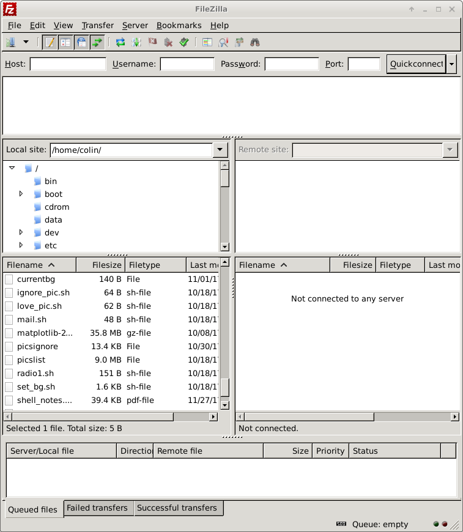
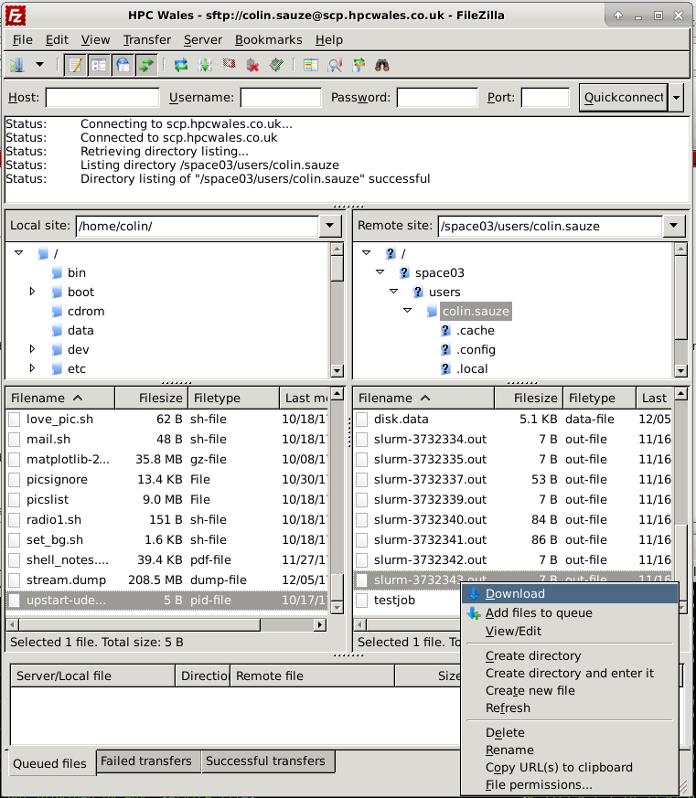
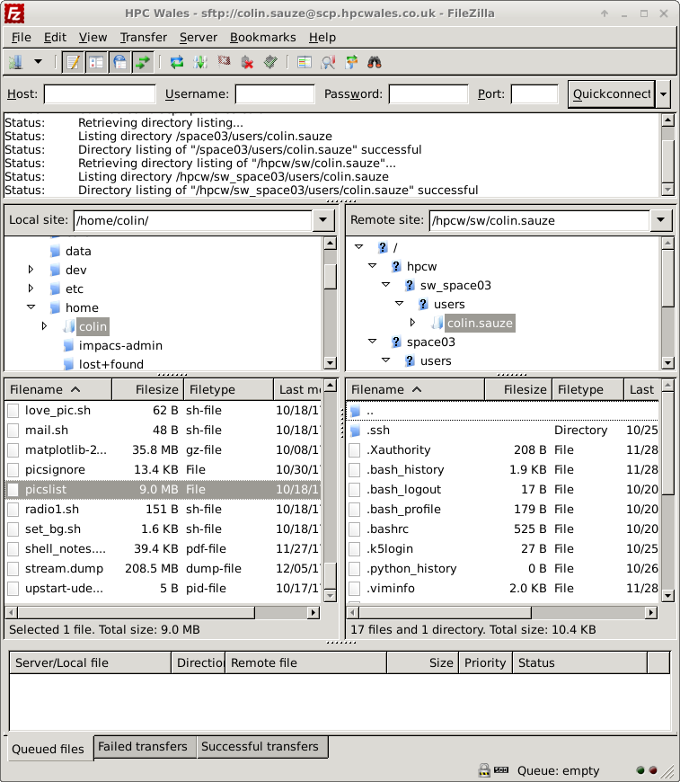

# Filesystems and Storage

## What is a filesystem?
Storage on most compute systems is not what and where you think they are! Physical disks are bundled together into a virtual volume; this virtual volume may represent one filesystem, or may be divided up, or partitioned, into multiple filesystems. And your directories then reside within one of these fileystems. Filesystems are accessed over the network through mount points.


There are multiple storage/filesystems options available for you to do your work. The most common are:
* home: where you land when you first login. 50 GB per user. Slower access, backed up. Used to store your work long term. 
* scratch: temporary working space. Faster access, not backed up. No quota, but old files might get deleted. DON'T STORE RESULTS HERE!

Here's a synopsis of filesystems on HPC Wales:


**Important!! Ensure that you don't store anything longer than necessary on scratch, this can negatively affect other people’s jobs on the system.**


# Accessing your filestore

## Where is my filestore located?

Both scratch and home filestore is on a per site basis. There are file servers in Bangor, Cardiff and Swansea each serving home and scratch directories to all the compute nodes. When you login to a cluster your home directory will be the home directory for that site and you won't have direct access to your files created at a different site. 

## How much quota do I have left on my home directory?

Login to a head node (e.g. cwl001, bwl001, sssl001 or csl001) and run the ```myquota``` command. This will tell you how much space is left in your home directory. 

~~~
$ myquota
~~~
{: .bash}

~~~
Disk quotas for group colin.sauze (gid 16782669): 
     Filesystem  blocks   quota   limit   grace   files   quota   limit   grace
cfsfs001-s03:/nfsshare/exports/space03
                   192M  51200M  53248M            2529    500k    525k    
~~~
{: .output}
    

## How much scratch have I used?

The ```df``` command tells you how much disk space is left. The ```-h``` argument makes the output easier to read, it gives human readable units like M, G and T for Megabyte, Gigabyte and Terrabyte instead of just giving output in bytes. By default df will give us the free space on all the drives on a system, but we can just ask for the scratch drive by adding ```/scratch``` as an argument after the ```-h```. 

~~~
$ df -h /scratch
~~~
{: .bash}

~~~
Filesystem            Size  Used Avail Use% Mounted on
mds001.hpcwales.local@tcp:mds002.hpcwales.local@tcp:/scratch
                      170T  149T   19T  90% /scratch
~~~
{: .output}

## Copying data from your PC to HPCW/SCW

You can copy files to/from your HPCW/SCW home and scratch drives using the secure copy protocol (SCP) or secure file transfer protocol (SFTP) and connecting to the host ```scp.hpcwales.co.uk``` or ```sftp.hpcwales.co.uk```. You will find your home and scratch directories in the following locations:

|Directory|Description|
|---|---|
|/hpcw/cf/firstname.surname/|Cardiff Home Directory|
|/hpcw/sw/firstname.surname/|Swansea Home Directory|
|/hpcw/ba/firstname.surname/|Bangor Home Directory|
|/hpcw/cf-scratch/firstname.surname|Cardiff Scratch|
|/hpcw/sw-scratch/firstname.surname|Swansea Scratch|
|/hpcw/ba-scratch/firstname.surname|Bangor Scratch|


### Copying data using the command line

Use the ```sftp``` command and connect to the system. This takes the argument of the username followed by an @ symbol and then the hostname (scp.hpcwales.co.uk). Optionally you can specify what directory to start in by putting a ```:``` symbol after this and adding the directory name. The command below will start in ```/hpcw/ba/jane.doe/```, if you don't specify the directory then the Cardiff directory is used. 

~~~
sftp jane.doe@scp.hpcwales.co.uk:/hpcw/ba/jane.doe/
~~~
{: .bash}


~~~
    Welcome to HPC Wales & Supercomputing Wales

 This system is for authorised users, if you do not
have authorised access please disconnect immediately.

Password: 
Connected to scp.hpcwales.co.uk.
Changing to: /hpcw/cf/jane.doe/
sftp> ls
~~~
{: .output}


The ```sftp``` and ```scp``` commands should be available on all Linux and Mac systems. On Windows systems they can be made available if you install the Linux Subsystem for Windows (Windows 10 only), the Github command line (CHECK ME).
Aberystwyth University Windows desktops already have it installed in ......


### Copying data using Filezilla

Filezilla is a graphical SCP/SFTP client available for Windows, Mac and Linux. You can download it from https://filezilla-project.org/download.php?type=client

Open filezilla and click on file menu and choose ```Site Manager```. 



A new site will appear under "My Sites". Name this site "HPC Wales" by clicking on Rename. Then enter "scp.hpcwales.co.uk" as the Host, your username as the user name and choose "Ask for password" as the logon type. Then click Connect. You should now be prompted for your password, go ahead and enter your HPC Wales password and click Ok. 


You should now have some files in the right hand side of the window. These are on the remote system, the list on the left hand side is your local system.


Files can be transferred either by dragging and dropping them from one side to the other. Or you can right click on a remote file and choose "Download" or a local file and choose "Upload". 




You can change directory on the remote host by typing a path into the "Remote site:" box. For example type in ```/hpcw/sw/user.name``` (where user.name is your username) to access your Swansea home directory. 




**Exercises**

> ## Using the `df` command. 
> 1. Login to Cardiff head node (`ssh cwl001` or `ssh cwl002` or `ssh cwl003`)
> 2. Run the command `df -h`.
> 3. How much space does /scratch have left? 
> 4. Logout from the Cardiff cluster by typing `exit` and login to the Swansea head node (ssl001, ssl002 or ssl003).
> 5. Run `df -h` again, how much space to /scratch in Swansea have left? 
> 6. If you had to run a large job requiring 10TB of scratch space, where would you run it?
{: .challenge}

> ## Using the `myquota` command.
> 1. Login to a system of your choice (try cwl001, bwl001 or ssl001)
> 2. Run the `myquota` command. 
> 3. How much space have you used and how much do you have left? 
> 4. If you had a job that resulted in 60GB of files would you have enough space to store them?
> 5. Try a different system and compare the amount of free space. 
{: .challenge}

> ## Copying files.
> 1. Login to the Bangor system, by typing `ssh bwl001`.
> 2. Create a file called hello.txt by using the nano text editor (or the editor of your choice) and typing `nano hello.txt`. Enter some text into the file and press Ctrl+X to save it. 
> 3. Use either Filezilla or SCP/SFTP to copy the file to your computer. The file will be in /hpcw/ba/user.name/hello.txt. 
> 4. Create a file on your computer using a text editor. Copy that file to your Bangor home directory using Filezilla or SCP/SFTP and examine its conents with nano on the Bangor system. 

