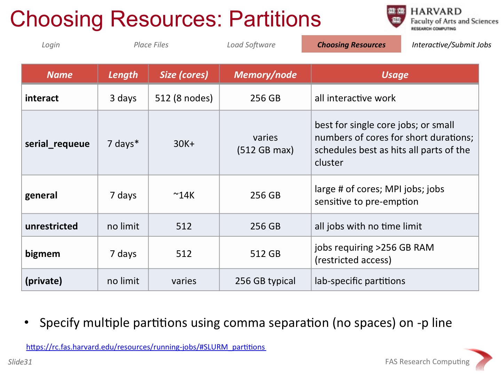

### Objectives
* Why use a cluster?
* Understand how a cluster is organized
* Understand what a filesystem is and which are appropriate to use
* Know how to interact with the scheduler
* Be comfortable creating a batch script and submitting one
* Know which command get info about and control jobs

### TOC
(insert TOC here)

Note: The majority of this document is based on the [Introduction to Odyssey (required) training for HPC users at Harvard University](https://rc.fas.harvard.edu/training/intro-to-odyssey/). Course materials can be found as a PDF file at [https://rc.fas.harvard.edu/wp-content/uploads/2015/05/Intro-to-Odyssey-v2-09.pdf](https://rc.fas.harvard.edu/wp-content/uploads/2015/05/Intro-to-Odyssey-v2-09.pdf)

### Cluster basics

Clusters, otherwise know as high-performance computing (HPC) or high-throughput computing systems, belong to a class of computing environments known as Advanced CyberInfrastructure (ACI). ACI resources also include other high-end compute systems such as distributed databases, large-scale fileystems, and software-defined networks. These tools are becoming the <em>de facto</em> standard tools in most research disciplines today.

## What are some of reasons to access a remote computer system?

* Your computer does not have enough resources to run the desired analysis (memory, processors, disk space, network bandwidth).
* You want to produce results faster than your computer can.
* You cannot install software in your computer (application does not have support for your operating system, conflicts with other existing applications)

## Advantages of using HPC/HTC vs. Cloud systems

* no need to transfer files before and after a remote cloud session
* security in knowing that you control how your data is managed
* access to local expertise
* economies of scale<
* cost: often local resources may be free or you'll know the cost up-front
* cloud work is well-suited for highly-parallelized, independent workloads (non-MPI)


## What does a cluster look like?

“High Performance Computing most generally refers to the practice of aggregating computing power in a way that delivers much higher performance than one could get out of a typical desktop computer or workstation in order to solve large problems in science, engineering, or business.” --http://insidehpc.com/hpc-basic-training/what-is-hpc/

Clusters are simply a grouping of computers (with the same components (RAM, disk, processors (or cores), and networking cards) as those in your desktop or laptop, but with more umph!) networked with high-speed interconnect that can be accessed (indirectly) through software, the scheduler, that manages simultaneous execution of jobs (or analyses) by multiple persons. 


The user accesses the compute cluster through one or more login nodes, and submits jobs to the scheduler, which will dispatch to and collect the completed work from the compute nodes. Frequently, clusters have shared disks, or filesystems, of various flavors where you can store your data, programs, and use for in-job execution (working or scratch areas)

### Filesystems

What is a filesystem?
Storage on most compute systems is not what and where you think they are! A given directory is part of a filesystem. Filesystems are slices of a virtual volume, combined from a bundle of disks. Filesystems are combined over the network through mount points.


There are often multiple filesystems available for you to do your work. The most common are:
* home: where you land when you first login
* shared (lab): a directory on the network
* "working" directories, like SCRATCH or TEMP

Home folders are great for keeping information specific to your account, your workflows, and your environment. Typically, these are backed up and are limited in space. Note that these are usually appropriate for small amounts of work (up to 10 or so jobs), as these are on filesystems with large #s of other accounts on low-throughput (low bandwidth) disk infrastructure.

Shared (lab) systems are typically the same, though may vary from site to site and will vary in size, backup strategy, and usage. These are also usually appropriate for small amounts of work (up to 10 or so jobs), as these are on filesystems with large #s of other accounts on low-throughput (low bandwidth) disk infrastructure.

"Working directories, often called TEMP, SCRATCH, or WORK, are often specialized, high-availability & high-speed systems designed especially for large volumes of read and write operations found on HPC/HTC systems. Often times this is not backed and files are deleted after a aged period of time (e.g. after 90 days old). Your typical workflow pattern is to stage files in this location prior to or part of your job, do your work, and then copy your final data back to your home or lab share. Ask your local instructor for more guidance on these systems.

Here's a synopsis of filesystems unique to Odyssey:


**Important!! Ensure that you use the proper filesystem for your work, as improper usage can negatively affect other people’s jobs on those same physical disks.**

### Working with the scheduler

As mentioned before, the scheduler is responsible for listening to your job requests, then finding the proper compute node that meets your job's resource requirements (RAM, # cores, time, etc), dispatches the job to that compute node, collects info about the completed work, and stores information about your job. If you've asked it to do so, it will even notify you about the status of your job (e.g. begin, end, fail, etc).

* how to interact with it
    srun, sbatch, squeue, scancel, and sacct
* what you need to know to get your work done
    resource requests
    partitions
    making & submitting script files

### Running & submitting jobs

There are two ways to run jobs on a cluster. One, usually done at the start, is to get an
interactive (foreground) session on a compute node. This looks and behaves exactly as when you first log into a compute
cluster (a login node), but the work is being done a compute node (a worker node on the cluster). This is 
usually a best practice technique, and should be done for all work that will tie up resources (e.g. CPU-
or memory-intensive tasks).

To get an interactive session, you issue the `srun` command with the appropriate parameters for requesting
the resources you require. For example:

```bash
srun --pty -p interact -t 0-6:00 --mem 1000 /bin/bash
```

This command requests from the scheduler a foreground (interactive) job with the following resources:
```bash
--pty           # a parameter specific for the srun command for bash sessions
-p interact     # the partition, or group of compute nodes to run on
-t 0-6:00       # time, in Days-Hours:Minutes format
--mem 1000      # memory request, in MB
/bin/bash       # the program we want to run, which is the bash shell
```

Two additional (optional) parameters were left out; as such, SLURM will give us the defaults:
```bash
-n 1            # how many cores (CPUs) we want (default = 1)
-N 1            # how many nodes we want the cores on (not needed, as we're getting one core; required otherwise)
```

The other method of running jobs on the cluster is by running a job in batch, using the sbatch command. On rare
occasion, you can use this just like the `srun` example, to run a simple command:

```bash
sbatch -p serial_requeue -t 0-0:15 --mem 1000 --wrap="rsync -av /source /destination"
```

The other way is to create a (batch submission) script file, which has these parameters embedded inside, and submit your script to the scheduler:

```bash
sbatch my_batch_script.sh
```

In all cases, the scheduler will return to you a jobID, a unique ID for your job that you can use to get info or control at that time, or refer to it historically.

For both foreground and background submissions, you are requesting resources from the scheduler to run your job. These are:
* time
* memory
* # of cores (CPUs)
* # of nodes
* (sort of) queue or grouop of machines to use


Choosing resources is like playing a game with the scheduler:
* You want to request enough to get your job completed without failure
* Request too much: your job is ‘bigger’ and thus harder to schedule
* Request too little: if your job goes over that requested, it is killed

Another way to think of 'reserving' a compute node for you job is like making a reservation at a restaurant:
* if you bring more guests to your dinner, there won't be room at the restaurant, but the wait staff may try to fit them in. If so, things will be more crowded and the kitchen (and the whole restaurant) may slow down dramatically
* if you bring fewer guests and don't notify the staff in advance, the extra seats are wasted; no one else can take the empty places, and the restaurant may lose money.

## Time
This is determined by test runs that you do on your code during an interactive session. Or, if you submit a , over-ask first, check the amount of time actually needed, then reduce time on later runs.
Due to scheduler overhead, bundle commands for minimum of 10 minutes / job
Memory:
Check software docs for memory requirements
If none stated, over-ask and do a trial run (via srun or sbatch)
use sacct command to get post-run job info:
sacct -j JOBID --format=JobID,JobName,ReqRam,MaxRSS,Elapsed	# RAM requested/used!!
“Never use a piece of bioinformatics software for the first time without looking to see what command-line options are available and what default parameters are being used”
	-- acgt.me · by Keith Bradnam


## Time

## Memory

## # of Cores

## # of Nodes

## Partitions

Here's a synopsis of partitions unique to Odyssey:



When creating submission scripts, use your favorite text editor and include the following sections:

**Required**

**Recommended**

**Optional**

## Example batch script (SLURM)

The following is an example submission script for an example `fastqc` run:

```bash
#!/bin/bash
#
#SBATCH -p serial_requeue        # Partition to submit to (comma separated)
#SBATCH -J frog_fastqc           # Job name
#SBATCH -n 1                     # Number of cores
#SBATCH -N 1                     # Ensure that all cores are on one machine
#SBATCH -t 0-0:10                # Runtime in D-HH:MM (or use minutes)
#SBATCH --mem 1000               # Memory in MB
#SBATCH -o fastqc.out            # File to which standard out will be written
#SBATCH -e fastqc.err            # File to which standard err will be written
#SBATCH --mail-type=ALL          # Type of email notification: BEGIN,END,FAIL,ALL
#SBATCH --mail-user=rmf@123.com  # Email to which notifications will be sent

source new-modules.sh; module load fastqc

# let's loop over all the files in the directory so that we compute for > 5 minutes
cd my_output_directory

fastqc --casava -o fastqc_reports A1_R1.pair.fastq.gz

#... more processing goes here ...

```


**Exercises**
* what would you need to change to make this a multicore (e.g. 8) job? Hint: more than one change is needed!
* create a SLURM script from scratch, asking to run `bwa mem` on all your trimmed  on the serial_requeue partition, with
2000 GB of RAM, 1 core, for 1 hr, and 
* create another SLURM script, now asking to run this 

## Managing jobs and getting job information

There are several commands that you can use to control and get info about your jobs:

`scancel` will be your friend. At some point, you'll fire off one or more jobs, and realize you've
made a mistake. (What? You don't make them? Then you can forget about this command) Here are a 
few examples of `scancel` in action:

```bash
scancel JOBID										# specific job
scancel -u bfreeman								    # ALL my jobs
scancel -u bfreeman -J many_blast_jobs				# named jobs
scancel -u bfreeman -p bigmem						# ALL in partition
```
`squeue` will give you pending (to be done), running, and recently completed job info. Some examples:

```bash
squeue -u bfreeman									# jobs for bfreeman
squeue -u bfreeman --states=R | wc –l				# # of Running jobs
```

`sacct` will give you current and historical information, since you were an HPC-infant. More examples:

```bash
sacct -u bfreeman									# jobs for bfreeman
sacct -u bfreeman -p bigmem --starttime=9/1/14		# same+bigmem partition
sacct -j JOBID --format=JobID,JobName,ReqRam,MaxRSS,Elapsed # RAM requested & used!!
```

**Other info**
See our list of common SLURM commands at https://rc.fas.harvard.edu/resources/documentation/convenient-slurm-commands/

For those coming from another cluster/scheduler, check our our scheduler Rosetta stone: http://slurm.schedmd.com/rosetta.pdf

**Exercises**
At the start of these exercises, your instructor will start a number of jobs. Once started, please
complete the following questions:
* what `scancel` command would you issue to XXX
* what `squeue` command would you use to XXX
* what `sacct` command would you use to see all your jobs named BLAST run between Aug 1st and Aug 15th?
* (Bonus!) Give the command to ....


## Best Practices

Again, working on a cluster is working in a big sandbox, with people of all ages and skills. So it is
important to work carefully and be considerate. Please visit our list of Common Pitfalls and 
Fair Use/Responsibilities pages so that you'll be a good member of the community...

Common Pitfalls: https://rc.fas.harvard.edu/resources/documentation/common-odyssey-pitfalls/
Fair Use/Responsibilities: https://rc.fas.harvard.edu/resources/responsibilities/


### Distributed System Definitions and stacks:
  (Note that many definitions exist for these terms)

 * Distributed application: an application that can be executed on a distributed system platform (e.g., mpiBLAST)
 * Distributed system platform: software layers that facilitates coordination and management of a distributed system (e.g., queue-based system, and MapReduce)
 * Distributed system:
   * High Performance Computing (HPC): large assemble of physical machines and a homogeneous operating system (e.g., your institutions' HPC, XSEDE's HPC)
   * Cloud Computing: virtual machines, distributed platforms and/or applications offered as a service (e.g., Amazon Web Services, Microsoft Azure, Google Cloud Computing)

 * Virtual machine (VM): software computer that like a physical computer can run an operating system and applications
 * Operating system (OS): the basic software layer that allows execution and management of applications
 * Physical machine: the hardware (processors, memory, disk and network)

### HPC vs. Cloud:

| HPC | Cloud |
|:----|:------|
| User account on the system | root account on the system |
| Limited control of the system | Full control of the system |
| Central shared file system | Local file system |
| Jobs submitted into a queue | Jobs executed on each resource |
| Account-based isolation | OS-based isolation |
| Batch-oriented execution of applications | support for batch or interactive applications |
| Request for resource and time allocation | Pay-per-use |
| etc. | etc.|


### Resources:

 * Cloud computing offerings:
  * Amazon EC2: http://aws.amazon.com/ec2/
  * Microsoft Azure: https://azure.microsoft.com/en-us/
  * Google Cloud Platform: https://cloud.google.com/
  * iPlant's Atmosphere: http://www.iplantcollaborative.org/ci/atmosphere
  * iPlant's help page: https://pods.iplantcollaborative.org/wiki/display/atmman/Atmosphere+Manual+Table+of+Contents
 * HPC offerings:
  * XSEDE: https://www.xsede.org/high-performance-computing
